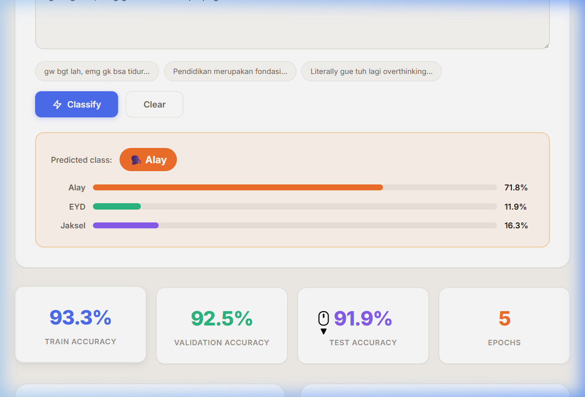
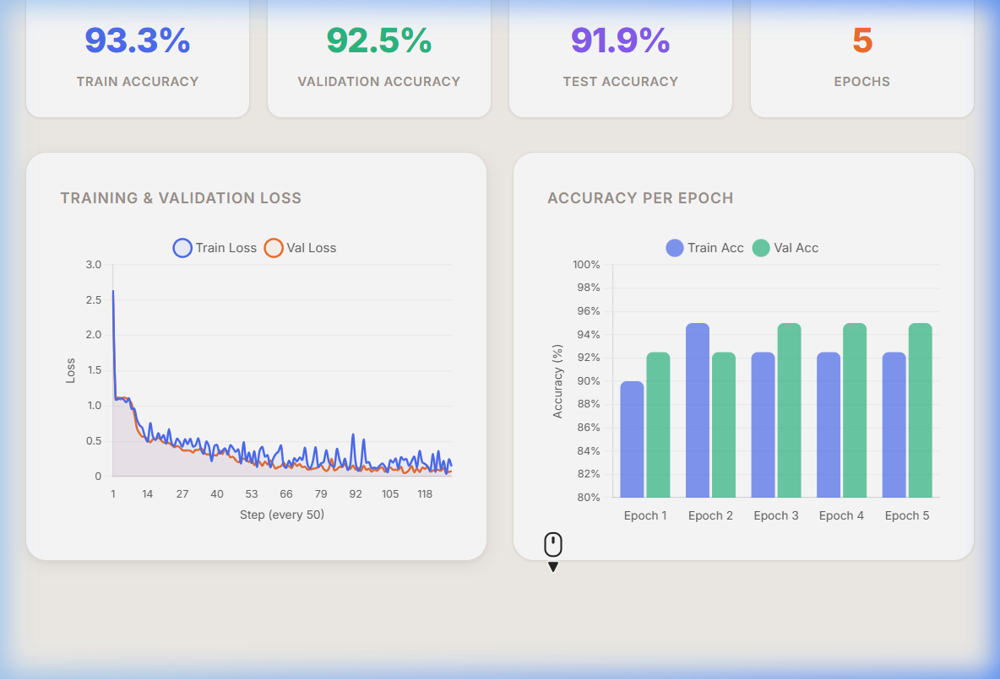

# Indonesian Sociolinguistics Text Classifier
### NLP Week 5 — Sociolinguistics

## Project Overview
A text classification system that categorizes Indonesian text into **3 sociolinguistic varieties**:

| Class | Description | Source |
|-------|-------------|--------|
| **EYD (Formal)** | Formal Indonesian following Ejaan Yang Disempurnakan rules | [Tere Liye — Tentang Kamu](https://archive.org/stream/tentangkamu/TENTANG%20KAMU_djvu.txt) |
| **Alay/Slang** | Informal Indonesian internet slang (e.g., "bgt", "gk", "kk") | [kamus-alay](https://github.com/nasalsabila/kamus-alay) |
| **Jaksel (Indonglish)** | Indonesian-English code-switching ("literally gue tuh...") | [indonglish-dataset](https://github.com/laksmitawidya/indonglish-dataset) |

## Project Structure
```
├── source-data/                           # Raw source datasets
│   ├── colloquial-indonesian-lexicon.csv  #   Alay/slang lexicon
│   ├── dataset.csv                        #   Jaksel tweets
│   └── eyd_tere_liye_tentang_kamu.txt     #   Novel text (EYD source)
├── cleaned-data/                          # Cleaned datasets
│   ├── eyd_cleaned.csv                    #   Cleaned EYD (9,118 rows)
│   ├── alay_cleaned.csv                   #   Cleaned alay (4,877 rows)
│   ├── jaksel_cleaned.csv                 #   Cleaned jaksel (5,065 rows)
│   ├── slang_dictionary.csv               #   Slang→Formal word mapping
│   └── alay_categories.csv               #   Slang category metadata
├── clean_eyd.py                           # EYD data cleaning script
├── clean_alay.py                          # Alay data cleaning script
├── clean_jaksel.py                        # Jaksel data cleaning script
├── eda.py                                 # Exploratory Data Analysis script
├── eda_output/                            # EDA visualization outputs
├── model.py                               # Classification model training
├── sociolinguistics_model.pkl             # Trained model (best: SVM, 99.00%)
├── ch06.ipynb                             # Reference notebook (Ch6 finetuning)
└── README.md                              # This file
```

## Progress

- [x] Dataset collection (EYD + Alay + Jaksel)
- [x] Dataset collection (EYD + Alay + Jaksel)
- [x] Data cleaning & preprocessing
- [x] Exploratory Data Analysis (EDA)
- [x] SVM Model training & evaluation
- [x] GPT-2 classification finetuning (`ch06-SCBI.ipynb`)
- [x] Interactive Web App UI

## Web App Classifier

The project includes an interactive web application that serves the trained sociolinguistics model via a Flask backend and a modern HTML frontend.



### Key Features
- **Real-time Classification**: Predicts if text is Alay, EYD, or Jaksel with confidence scores
- **Sample Inputs**: Test the model instantly using pre-configured sample texts
- **Training Metrics**: Visualizes the loss curve and accuracy charts from the GPT-2 finetuning process



## EDA Findings

| Metric | EYD (Formal) | Alay/Slang | Jaksel |
|--------|-------------|-----------|--------|
| Samples | 9,118 | 4,877 | 5,065 |
| Avg text length | ~70 chars | ~72 chars | ~105 chars |
| Avg word count | ~11 | ~12 | ~18 |
| Top slang category | — | abreviasi (7,162) | — |
| English word ratio | Low | Low | ~24.4% avg |
| Metric | EYD (Formal) | Alay/Slang | Jaksel |
|--------|-------------|-----------|--------|
| Samples | 9,118 | 4,877 | 5,065 |
| Avg text length | ~70 chars | ~72 chars | ~105 chars |
| Avg word count | ~11 | ~12 | ~18 |
| Top slang category | — | abreviasi (7,162) | — |
| English word ratio | Low | Low | ~24.4% avg |

## Model Results

### SVM Baseline
Best baseline model: **Linear SVM** with char n-gram TF-IDF (2-5 grams)

| Model | Accuracy |
|-------|----------|
| **Linear SVM** | **99.00%** ★ |
| Logistic Regression | 98.01% |
| Multinomial NB | 94.64% |
| Word-level LR | 96.39% |
| **Linear SVM** | **99.00%** ★ |
| Logistic Regression | 98.01% |
| Multinomial NB | 94.64% |
| Word-level LR | 96.39% |

### GPT-2 Finetuning (`ch06-SCBI.ipynb`)
We adapted the GPT-2 classification finetuning workflow from *Build a Large Language Model From Scratch* (Ch 6) for our 3-class sociolinguistics task.
- Base model: GPT-2 Small (124M)
- Final Training Accuracy: **93.3%**
- Final Validation Accuracy: **92.5%**
- Final Test Accuracy: **91.9%**

### 0. Download Pretrained Models & Weights
Because the model weights are too large for GitHub (over 100MB), you need to download them manually before running the app.

1. **Download the models** from this Google Drive link: [[Click me](https://drive.google.com/file/d/1n74P8OnIsTar6yC5rTQXQ0f2L34wcXDD/view?usp=sharing)]
2. **Extract/Move the files** to the directory **one folder exactly above** this project root directory.

Your folder structure should look like this:
```
├── [Your Parent Folder]/
│   ├── scbi_classifier.pth        # GPT-2 Finetuned Weights
│   ├── sociolinguistics_model.pkl # SVM Baseline Model
│   ├── gpt2/                      # OpenAI GPT-2 Base Weights
│   └── Sociolinguistics-Classification-Bahasa-Indonesia/ (This repo)
│       ├── server.py
│       ├── ch06-SCBI.ipynb
│       └── ...
```

### 1. Data Processing & Baseline Models
```bash
# Clean datasets
python clean_eyd.py
python clean_alay.py
python clean_jaksel.py

# Run EDA
python eda.py

# Optional: Train SVM baseline model locally
python model.py
```

### 2. Large Language Model Finetuning
If you want to train the GPT-2 model yourself instead of using the downloaded weights, open and run the notebook:
```bash
jupyter notebook ch06-SCBI.ipynb
```

### 3. Run the Web App
The interactive web app serves the baseline model and visualizes the LLM training metrics. Make sure you have downloaded the models and placed them in the parent folder as explained in Step 0.
```bash
# Start the Flask server
python server.py

# Open your browser to:
# http://127.0.0.1:5000
```
